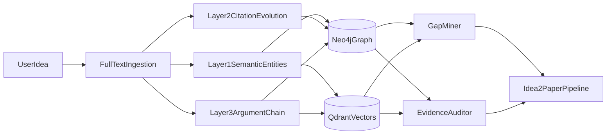

# 完整证据链 KG 升级执行计划

## 目标与默认约束

- 目标：把当前“相似检索型 KG”升级为“证据链推理型 KG”，支持 `PROBLEM -> GAP -> CORE_IDEA -> CLAIM -> EVIDENCE` 的可追溯推理。
- 默认技术路线：保留现有 LightRAG 思想（实体+关系+向量双检索），工程实现采用 `Neo4j + Qdrant`，并通过接口层兼容现有召回与 story 生成链路。
- 默认迁移策略：先兼容、后替换；先小样本可用、再全量扩展；避免一次性推翻当前 `nodes_*.json + networkx` 流程。

## 现状基线与改造入口

- 现有构建入口：`[/workspace/idea2paper_product/Paper-KG-Pipeline/scripts/tools/build_entity_v4.py](/workspace/idea2paper_product/Paper-KG-Pipeline/scripts/tools/build_entity_v4.py)`（节点仍以 `Paper/Idea/Pattern/Domain` 为主，输入核心是 title+abstract 派生结构）。
- 现有边构建入口：`[/workspace/idea2paper_product/Paper-KG-Pipeline/scripts/tools/build_edges_embedding.py](/workspace/idea2paper_product/Paper-KG-Pipeline/scripts/tools/build_edges_embedding.py)`（边主要服务三路召回，缺少 citation intent 与 claim-evidence）。
- 现有检索入口：`[/workspace/idea2paper_product/Paper-KG-Pipeline/src/idea2paper/recall/recall_system.py](/workspace/idea2paper_product/Paper-KG-Pipeline/src/idea2paper/recall/recall_system.py)`（强耦合本地 JSON+pickle 图结构）。
- 目标文档基线：`[/workspace/idea2paper_product/Paper-KG-Pipeline/kg_architecture.md](/workspace/idea2paper_product/Paper-KG-Pipeline/kg_architecture.md)`、`[/workspace/idea2paper_product/Paper-KG-Pipeline/顶会智能体的思路.md](/workspace/idea2paper_product/Paper-KG-Pipeline/顶会智能体的思路.md)`、`[/workspace/idea2paper_product/Paper-KG-Pipeline/implementation_plan.md](/workspace/idea2paper_product/Paper-KG-Pipeline/implementation_plan.md)`、`[/workspace/idea2paper_product/Paper-KG-Pipeline/lightrag_vs_graphrag.md](/workspace/idea2paper_product/Paper-KG-Pipeline/lightrag_vs_graphrag.md)`。

## 目标架构（分层+双存储）

## 分阶段实施（P0/P1/P2/P3）

### P0：兼容层与基础重构（先不改变产品行为）

- 新增 `KgRepository` 与 `VectorIndex` 抽象，隔离 `recall_system.py` 对本地文件结构的强耦合。
- 保留现有 Path1/Path2/Path3 打分公式，仅替换候选获取方式（接口化）。
- 产出 JSON/NetworkX 适配器（现有后端）+ Neo4j/Qdrant 适配器骨架。
- 验收标准：同一输入 idea 下，旧链路与新接口链路召回 Top-K 一致性可对齐（允许轻微排序差异）。

### P1：Layer 1 语义实体层（全文 section 感知）

- 增加论文全文入口与 section zoning（abstract/introduction/related_work/method/experiments/limitation/conclusion）。
- 抽取并入图 `METHOD/DATASET/TASK/METRIC/MODEL/FRAMEWORK/CONCEPT` 及关系 `APPLIED_ON/EVALUATED_BY/OUTPERFORMS/USES/PROPOSES`。
- 在 Qdrant 建立实体向量与文本单元向量索引，保留来源锚点（paper_id + section + text_span）。
- 验收标准：样本集中实体抽取入图成功率稳定，且可按实体回溯到原文 section 证据。

### P2：Layer 2 发展脉络层（引用意图+技术演化）

- 构建 `Paper->Paper` 引用边，补充意图标签：`CITES_FOR_PROBLEM/CITES_AS_BASELINE/CITES_FOR_FOUNDATION/CITES_AS_COMPARISON`。
- 构建方法演化边 `EVOLVES_FROM`（带 year/time_span 与上下文证据）。
- 支持按时间与意图查询技术路径，产出“研究脉络链”。
- 验收标准：给定方法/任务可返回可解释的时间序列演化链，并含引用意图证据。

### P3：Layer 3 论证层（核心）

- 建模 `PROBLEM/GAP/CORE_IDEA/CLAIM/EVIDENCE/BASELINE/LIMITATION`，建立 `supports/partially_supports/refutes/unverifiable` 边。
- 实现两类引擎：
  - `GapMiner`：输出可证伪 gap statement 与最强近邻冲突。
  - `EvidenceAuditor`：输出 claim-evidence ledger（含 P0/P1/P2 严重度）。
- 增加 numeric verifier：校验文本主张与实验数值一致性。
- 验收标准：可对单篇论文自动生成“Gap Statement + Claim-Evidence 台账”，并能定位未闭环 claim。

## 增量更新机制（贯穿 P1-P3）

- 引入 `kg_snapshot_id`、`paper_version_hash`、`extractor_version`，支持按论文粒度重算与局部回填。
- 对新论文执行：`全文解析 -> 抽取 -> Neo4j upsert -> Qdrant upsert -> 受影响子图重评估`。
- 增量策略优先级：先实体层与引用层增量，再论证层局部重算（仅重算受影响 claim/evidence 子图）。
- 验收标准：新增论文后无需全量重建，更新耗时与新增论文数量近线性相关。

## 测试与质量门槛

- 建立三类回归集：召回一致性集、引用意图标注集、claim-evidence 人工标注集。
- 增加端到端评测：idea 输入后，是否能同时返回“可用候选模式 + 证据链风险提示”。
- 关键指标：实体抽取准确率、citation intent 准确率、claim 状态判定一致率、增量更新时延。

## 风险与缓解

- 风险1：全文解析噪声影响下游抽取。缓解：section 置信度与 fallback 解析器并行。
- 风险2：迁移期间行为漂移。缓解：P0 保持打分公式不变，仅替换数据来源。
- 风险3：外部学术 API 不稳定。缓解：引文数据本地缓存与重试队列。
- 风险4：图 schema 膨胀。缓解：先固定最小闭环 schema，再按查询需求扩展。

